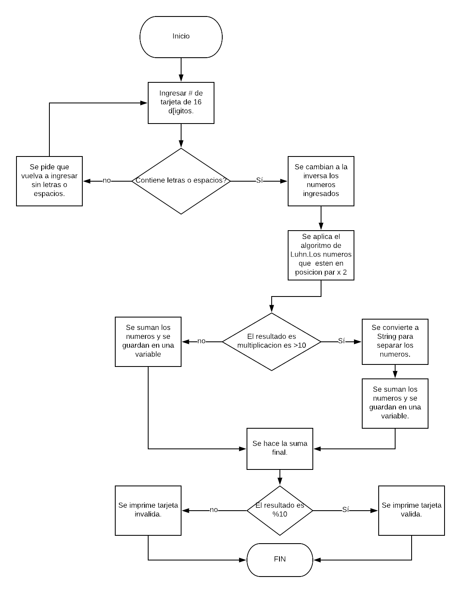

# Tarjeta con Número Valido.
Crea una web que pida, por medio de un prompt(), el número de una tarjeta de crédito y confirme su validez según el algoritmo de Luhn.
## Descripción.
Se crea una función que toma como argumento los números de una tarjeta de crédito y verifica si esta es válida o no.

## Pseudocódigo.
1. Crear una variable para guardar el número que el usuario ingresa.
2. Se itera entre el número para comprobar que no existan espacios u otro signo inválido.
3. Una vez comprobado que el número está ingresado correctamente, se itera para agregar los valores a un array, pero en orden opuesto.
4. Se separan los números de dos en dos, se seleccionan y vuelven a guardarse los nuevos valores en un array para que puedan multiplicarse por 2.
5. Una vez multiplicados, los valores resultantes que contengan dos dígitos, se suman dichos dígitos para obtener un valor de un solo dígito.
6. Se suman todos los valores ya transformados, para hacer efectiva la validez o no validez del número de la tarjeta por medio de un true o false.

## Diagrama de flujo.

